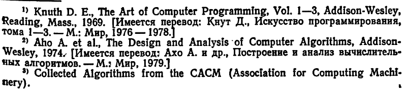

*Час, потраченный на выбор алгоритма, стоит пяти часов программирования.*

## Важность грамотного подбора алгоритма на примерах

Примеры ниже демонстрируют сокращение времени выполнения при правильном подборе алгоритма.

Пример 2: сравнение алгоритмов проверки, является ли число простым.

... добавить схемы, разобраться, сделать выжимку ...

Экономию памяти -- подобрать эффективный рекурсивный алгоритм ??

---

Рекомендованная литература

