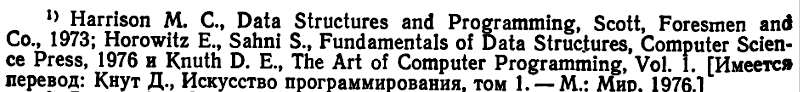

*Выбирайте представление данных, соответствующее задаче.*

На данном этапе:
    - выбораются структуры данных;
    - описываются процессы обработки данных;
    - составление спецификации входных и выходных данных (форматы ввода-вывода, гл. 2.9);
    - подбираются примеров данных, наилучшим образом демонстрирующих работу спроектированной системы;

*Хорошо подобранное описание данных существенно сокращается программу.*

---

Рекомендованная литература

